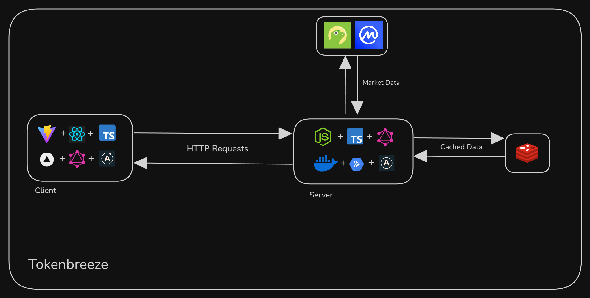

<h1 style="display:flex; flex-direction:row; gap:1rem; align-items:center; justify-items:center;"> TokenBreeze </h1>
Just another token price aggregator.

### Index

- [Tech Stack](#tech-stack)
- [Architecture](#architecture)
- [Setup locally](#setup-locally)

### Tech Stack

- Frontend
  - React
  - TypeScript
  - GraphQL + Apollo Client
- Backend
  - Node.js + Express
  - GraphQL + Apollo Server
  - Redis
  - Docker
- Testing
  - Mocha + Chai
  - Grafana k6

### Architecture



### Setup Locally

- Setup .env files in client and server directories based on the .env.example files

Run both using start script

```
./start.sh
```

Run client

```
cd client && npm i && npm run dev
```

Run server

```
cd server && npm i && npm run dev
```

Run using Docker

```
docker compose up
```
