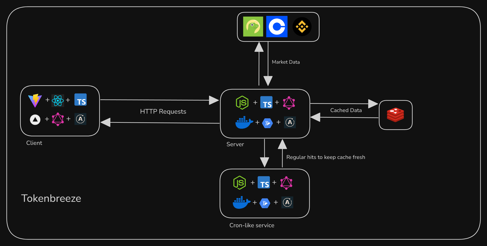

#  TokenBreeze

<p align="start"><b>A fast, full-stack crypto price dashboard with cross-provider comparison.</b></p>

## Features

- Real-time token prices from CoinGecko + CoinMarketCap
- Click-to-view modal with price charts and historical data
- Redis caching to reduce provider API load
- Full-stack GraphQL API powering the frontend
- Dockerized for easy deployment

## Tech Stack

### Frontend

- React + TypeScript
- Tailwind CSS
- Apollo Client (GraphQL)

### Backend

- Node.js + Express
- Apollo Server (GraphQL)
- Redis
- Docker

### Testing & Load

- Mocha + Chai
- k6 (via Grafana Cloud)

### CLI

- Rust
- Clap
- Reqwest
- Serde

## Architecture



> TokenBreeze is designed for performance and scalability. Market data is cached on the server to minimize redundant API calls and improve response time. Charting is rendered on-demand using client-side modals.

## Running Locally

1. Clone the repo
2. Set up `.env` files in both `client/` and `server/` directories (see `.env.example`)
3. Start everything:

```bash
./start.sh
```

Or run individually:

```bash
# Client
cd client && npm i && npm run dev

# Server
cd server && npm i && npm run dev
```

Or use docker:

```bash
docker compose up
```
